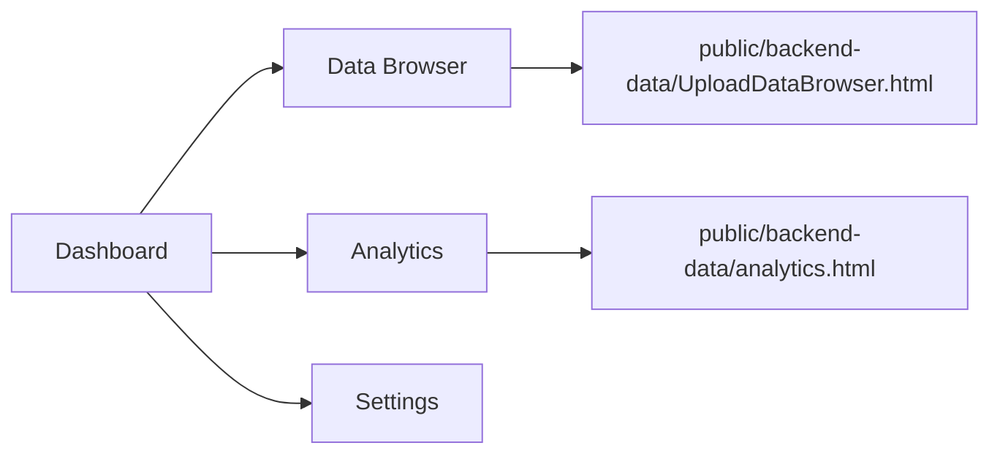

# Star Q Analytics Dashboard


**Star Q Analytics Dashboard** is a polished Next.js dashboard shell for **Sri Siri Publishers, Machilipatnam**. The app provides the branded dashboard UI, navigation, dark mode, chart/demo widgets, settings shell, and embedded backend tools for real upload and analytics workflows.

The active upload and backend-connected data workflow lives in:

```text
public/backend-data/UploadDataBrowser.html
```

The active analytics view lives in:

```text
public/backend-data/analytics.html
```

These HTML tools are mounted inside the Next.js app through iframe pages.

<p align="center">
  
</p>

---

## Highlights

| Area | Capability |
| --- | --- |
| Dashboard | KPI cards, quick actions, revenue chart, and distributor summary UI |
| Data Browser | Embedded backend data browser with the actual upload workflow |
| Analytics | Embedded analytics dashboard from `public/backend-data/analytics.html` |
| Interface | Responsive sidebar layout, header, dark mode, and reusable UI components |
| Branding | Sri Siri Publishers logo and Star Q Analytics visual system |

---

## Application Map



---

## Architecture

```mermaid
flowchart TB
    subgraph NextApp["Next.js App Router"]
        Dashboard[Dashboard UI]
        AnalyticsPage[/analytics page]
        DataPage[/data page]
        Settings[Settings page]
        Components[Reusable React Components]
    end

    subgraph StaticTools["Public Backend Data Tools"]
        DataHTML[UploadDataBrowser.html]
        AnalyticsHTML[analytics.html]
    end

    subgraph ExternalBackend["Deployed Backend"]
        Backend[Backend endpoints configured inside HTML tools]
    end

    Dashboard --> DataPage
    Dashboard --> AnalyticsPage
    DataPage --> DataHTML
    AnalyticsPage --> AnalyticsHTML
    DataHTML --> Backend
    AnalyticsHTML --> Backend
```

---

## Tech Stack

| Layer | Tools |
| --- | --- |
| Framework | Next.js 14 App Router |
| UI | React 18, TypeScript, Tailwind CSS |
| Icons | lucide-react |
| Charts | Recharts |
| Dates | date-fns |
| Build Tooling | ESLint, PostCSS, Autoprefixer |

---

## Quick Start

### Prerequisites

- Node.js 18.17 or newer
- npm

### Installation

```bash
npm install
```

### Run Locally

```bash
npm run dev
```

Open the app at:

```text
http://localhost:3000
```

---

## Project Structure

```text
public/
  backend-data/
    UploadDataBrowser.html
    analytics.html
  images/
    logo.png
src/
  app/
    analytics/page.tsx
    data/page.tsx
    settings/page.tsx
    globals.css
    layout.tsx
    page.tsx
  components/
    dashboard/
    layout/
    ui/
    ThemeProvider.tsx
package.json
tailwind.config.js
tsconfig.json
```

---

## Routes

| Route | Purpose |
| --- | --- |
| `/` | Main dashboard with KPIs, quick actions, chart widget, and distributor summary |
| `/analytics` | Embedded analytics dashboard from `public/backend-data/analytics.html` |
| `/data` | Embedded backend data browser from `public/backend-data/UploadDataBrowser.html` |
| `/settings` | Settings shell with backend workflow link |

There is no separate `/upload` page anymore. Uploads should be done from the Data Browser.

---

## Backend Data Files

The files in `public/backend-data/` are intentionally kept as static HTML assets because they contain the current backend-connected workflow.

| File | Purpose |
| --- | --- |
| `UploadDataBrowser.html` | Data browser and upload workflow |
| `analytics.html` | Backend-connected analytics dashboard |

If backend URLs change, update them inside the relevant HTML file.

---

## Available Scripts

Run scripts from the `frontendMain` directory.

| Command | Description |
| --- | --- |
| `npm run dev` | Start the local development server |
| `npm run build` | Create a production build |
| `npm run start` | Serve the production build |
| `npm run lint` | Run Next.js linting |

---

## Deployment Notes

1. Install dependencies with `npm install`.
2. Confirm the backend URLs inside `public/backend-data/*.html`.
3. Build the app with `npm run build`.
4. Deploy through a Next.js-compatible platform.

This frontend no longer includes local MongoDB, Mongoose models, Excel parsing APIs, or Next.js upload API routes.

---

## Roadmap Ideas

- Replace the embedded HTML tools with native React pages when the backend API stabilizes.
- Wire dashboard KPI cards to live backend summary data.
- Add authentication for dashboard and backend tool access.
- Add loading and error states around iframe-backed pages.
- Add tests for layout and navigation behavior.
