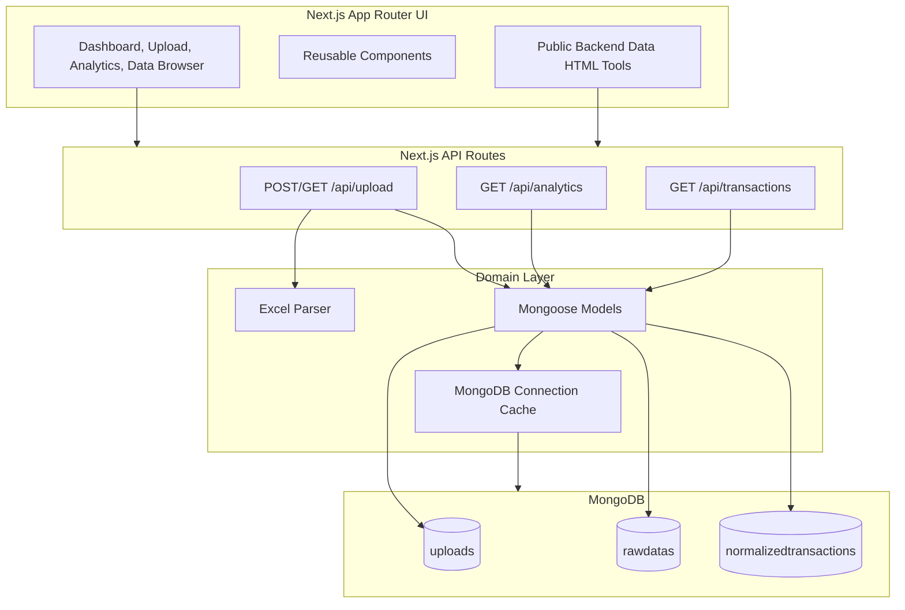
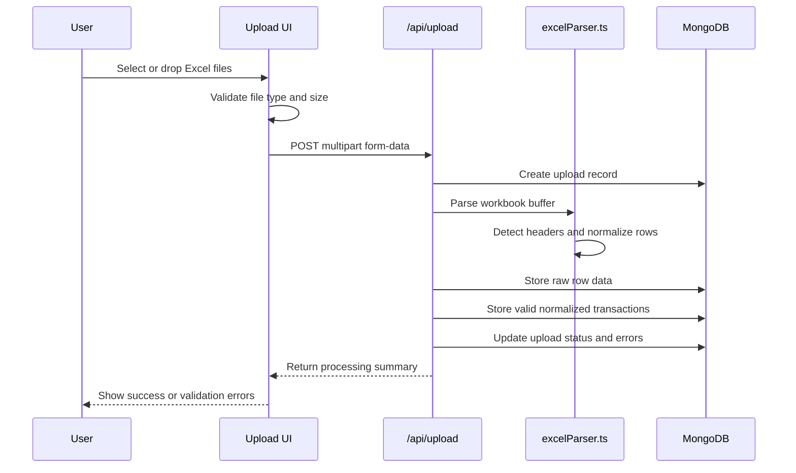
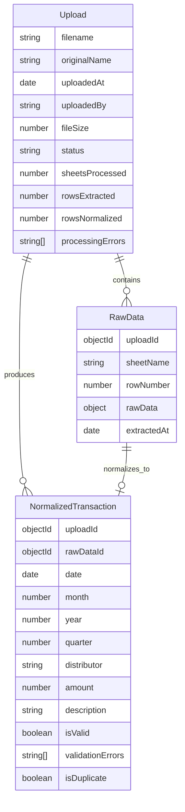

# Star Q Analytics Dashboard


**Star Q Analytics Dashboard** is a professional sales-data intelligence platform for **Sri Siri Publishers, Machilipatnam**. It imports Excel workbooks, preserves raw uploaded records, normalizes valid sales transactions, and exposes dashboard-ready analytics through a polished Next.js interface.

<p align="center">
  
</p>

---

## Table of Contents

- [Highlights](#highlights)
- [Application Map](#application-map)
- [Architecture](#architecture)
- [Data Pipeline](#data-pipeline)
- [Tech Stack](#tech-stack)
- [Quick Start](#quick-start)
- [Environment Variables](#environment-variables)
- [Project Structure](#project-structure)
- [Routes](#routes)
- [API Reference](#api-reference)
- [Database Model](#database-model)
- [Excel Import Rules](#excel-import-rules)
- [Available Scripts](#available-scripts)
- [Deployment Notes](#deployment-notes)
- [Roadmap Ideas](#roadmap-ideas)

---

## Highlights

| Area | Capability |
| --- | --- |
| Uploads | Drag-and-drop Excel upload for `.xls` and `.xlsx` files up to 10 MB |
| Parsing | Multi-sheet workbook parsing with flexible header detection |
| Validation | Required date, amount, and distributor checks before normalization |
| Storage | Raw rows and analytics-ready transactions stored separately in MongoDB |
| Analytics | Summary, monthly, quarterly, daily, and distributor revenue aggregations |
| Interface | Responsive dashboard with sidebar navigation, dark mode, cards, charts, and upload history |
| Embedded Tools | Static backend data browser and analytics pages mounted inside app iframes |

---

## Application Map

```mermaid
flowchart LR
    A[Dashboard] --> B[Upload Data]
    A --> C[Analytics]
    A --> D[Data Browser]
    A --> E[Settings]

    B --> F[Excel Uploader]
    B --> G[Upload History]
    C --> H[Embedded Analytics HTML]
    D --> I[Embedded Pipeline Tester HTML]

    F --> J[/api/upload]
    H --> K[/api/analytics]
    I --> L[/api/transactions]
```

---

## Architecture



---

## Data Pipeline



---

## Tech Stack

| Layer | Tools |
| --- | --- |
| Framework | Next.js 14 App Router |
| UI | React 18, TypeScript, Tailwind CSS |
| Icons | lucide-react |
| Charts | Recharts |
| Data Import | xlsx |
| Database | MongoDB with Mongoose |
| Dates | date-fns |
| Build Tooling | ESLint, PostCSS, Autoprefixer |

---

## Quick Start

### Prerequisites

- Node.js 18.17 or newer
- npm
- MongoDB running locally or a MongoDB connection string

### Installation

```bash
npm install
```

### Configure Environment

Create a local environment file from the example:

```bash
cp .env.example .env.local
```

Update the MongoDB connection string if needed:

```env
MONGODB_URI=mongodb://localhost:27017/starq
NEXT_PUBLIC_APP_NAME=Star Q Analytics
```

### Run Locally

```bash
npm run dev
```

Open the app at:

```text
http://localhost:3000
```

---

## Environment Variables

| Variable | Required | Default / Example | Description |
| --- | --- | --- | --- |
| `MONGODB_URI` | Yes | `mongodb://localhost:27017/starq` | MongoDB database connection used by Mongoose |
| `NEXT_PUBLIC_APP_NAME` | No | `Star Q Analytics` | Public-facing application name |

---

## Project Structure

```text
public/
  backend-data/
    UploadDataBrowser.html
    analytics.html
  images/
    logo.png
src/
  app/
    api/
      analytics/route.ts
      transactions/route.ts
      upload/route.ts
    analytics/page.tsx
    data/page.tsx
    settings/page.tsx
    upload/page.tsx
    layout.tsx
    page.tsx
  components/
    dashboard/
    layout/
    ui/
    upload/
  lib/
    excelParser.ts
    models.ts
    mongodb.ts
package.json
tailwind.config.js
tsconfig.json
```

---

## Routes

| Route | Purpose |
| --- | --- |
| `/` | Main dashboard with KPIs, quick actions, revenue chart, and distributor summary |
| `/upload` | Excel file upload workflow and upload history |
| `/analytics` | Embedded analytics dashboard from `public/backend-data/analytics.html` |
| `/data` | Embedded pipeline tester/data browser from `public/backend-data/UploadDataBrowser.html` |
| `/settings` | Settings page shell |

---

## API Reference

### `POST /api/upload`

Uploads and processes an Excel workbook.

| Field | Type | Description |
| --- | --- | --- |
| `file` | `File` | `.xls` or `.xlsx` workbook, maximum 10 MB |

Successful response:

```json
{
  "success": true,
  "uploadId": "665000000000000000000000",
  "filename": "sales.xlsx",
  "sheetsProcessed": 2,
  "rowsProcessed": 120,
  "validRows": 115,
  "invalidRows": 5,
  "errors": []
}
```

### `GET /api/upload`

Returns the 20 most recent upload records.

### `GET /api/analytics`

Returns aggregated analytics for valid normalized transactions.

| Query | Values | Description |
| --- | --- | --- |
| `type` | `summary`, `monthly`, `quarterly`, `distributors`, `daily` | Analytics view to return |
| `startDate` | ISO date | Optional lower date bound |
| `endDate` | ISO date | Optional upper date bound |
| `distributor` | string or `all` | Optional distributor filter |

### `GET /api/transactions`

Returns paginated normalized transactions.

| Query | Default | Description |
| --- | --- | --- |
| `page` | `1` | Current page number |
| `limit` | `20` | Records per page |
| `search` | none | Searches distributor and description |
| `distributor` | none | Filters by distributor |
| `startDate` | none | Lower date bound |
| `endDate` | none | Upper date bound |

---

## Database Model



---

## Excel Import Rules

The parser accepts flexible column names and scans the first 10 rows to find likely headers.

| Target Field | Accepted Header Examples |
| --- | --- |
| Date | `date`, `Invoice Date`, `Transaction Date`, `Bill Date` |
| Amount | `amount`, `Total`, `Revenue`, `Value`, `Sale Amount`, `Net Amount` |
| Distributor | `distributor`, `Dealer`, `Name`, `Party`, `Customer` |
| Description | `description`, `Details`, `Particulars`, `Item`, `Product` |

Validation requirements:

- A valid transaction must include a date, amount, and distributor.
- Empty rows and total/summary rows are skipped.
- Excel serial dates and common string date formats are supported.
- Financial quarters follow the Indian financial year:
  - Q1: April to June
  - Q2: July to September
  - Q3: October to December
  - Q4: January to March

---

## Available Scripts

Run scripts from the project root.

| Command | Description |
| --- | --- |
| `npm run dev` | Start the local development server |
| `npm run build` | Create a production build |
| `npm run start` | Serve the production build |
| `npm run lint` | Run Next.js linting |

---

## Deployment Notes

1. Provision a MongoDB database.
2. Set `MONGODB_URI` in the hosting provider environment.
3. Install dependencies with `npm install`.
4. Build the app with `npm run build`.
5. Start the app with `npm run start` or deploy through a Next.js-compatible platform.

For production usage, consider adding authentication around upload, analytics, and transaction APIs before exposing the dashboard publicly.

---

## Roadmap Ideas

- Add authenticated user roles for administrators and viewers.
- Add duplicate transaction detection and import rollback.
- Add CSV export for filtered transaction views.
- Add dashboard KPIs that fetch live summary data.
- Add automated tests for parser edge cases and API route validation.
- Replace embedded static data tools with native React pages as the product matures.

---

## Maintainer Notes

This project currently keeps raw spreadsheet rows and normalized transaction rows in separate collections. That design is useful for auditability: failed or partially valid uploads can be inspected without losing the original imported data.
